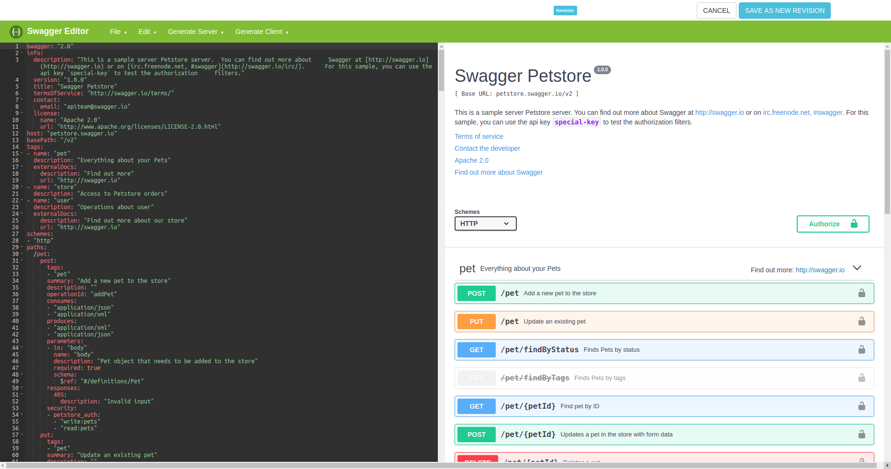

# Swagger Editor Hook

This project is just a custom top banner, that give you the possibility to perform an action after any change on swagger ui.

### Recipe: ###
	npm install 
	npm run regenlib

### Import da lib no Swagger Editor 3 ###
	Once you have swagger-editor-hook compiled, you'll need:
		Go inside your swagger-editor-^3 official project.
		Execute command: npm install <swagger-editor-hook dir> --save
			Ex: npm install ../swagger-editor-hook --save

### Modifing Swagger Editor to our custom top banner ###
	File topbar.jsx:
		import ManagerSwaggerHeader from "swagger-editor-hook"
		import { BrowserRouter as Router, Route } from 'react-router-dom'
		Create method componentWillMount() who will be in charge of call ManagerSwaggerHeader.getSwaggerFromManager() and render at swagger ui.
			-> this.props.specActions.updateSpec(YAML.safeDump(YAML.safeLoad(JSON.stringify(success.data))) or
			-> this.clearEditor(); in case it failed.
		Create method raiseError that would do error "toastr".
			-> Need to inject a div with the component ToastContainer inside html.
		On method render(), mount the new component <Router> <Route path="/" component={ManagerSwaggerHeader}/> </Router>
		Replace line <Modal className="swagger-ui modal" ref="modal"> to <Modal className="swagger-ui modal-editor" ref="modal">
			-> Rename class 'modal' to 'modal-editor' at topbar.less file.

### Custom functions that need to be implemented ###
ManagerSwaggerHeader.getXSRFToken() -> In case you need a CSRF/XSRF token, here is the place.
ManagerSwaggerHeader.getSwaggerFromManager() -> Need to be implemented, this needs to get a swagger content.
ManagerSwaggerHeader.callbackToApisList() -> It will redirect user to specific page.
ManagerSwaggerHeader.callbackToApiOverview() -> It will redirect user to specific page.
ManagerSwaggerHeader.saveNewRevision() -> It performs the save action, based on what you have done inside swagger ui.

### How it looks like ###

